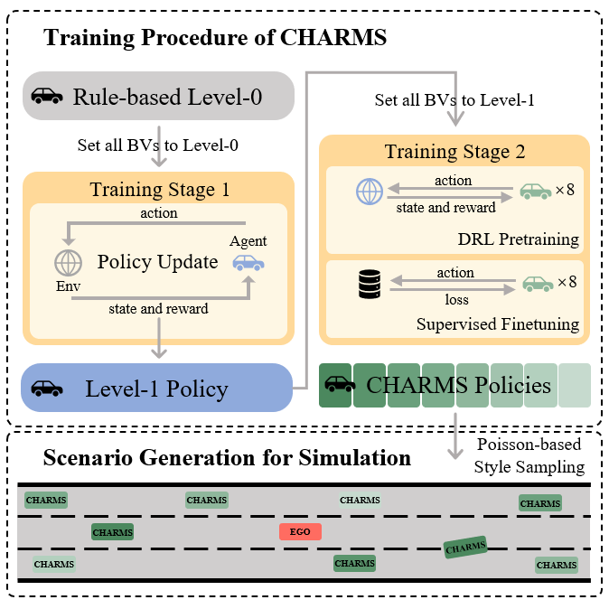
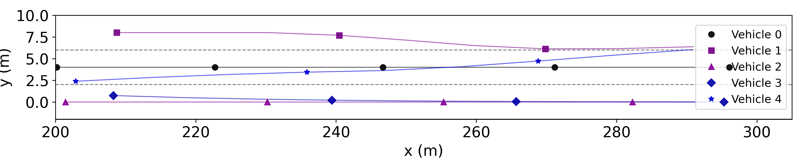
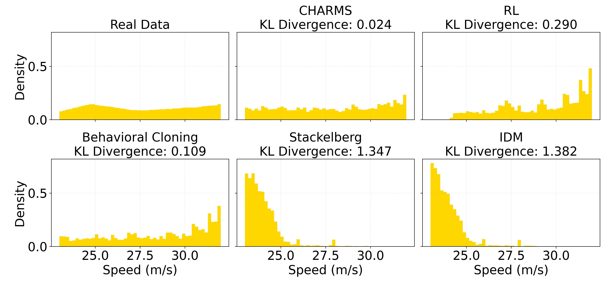
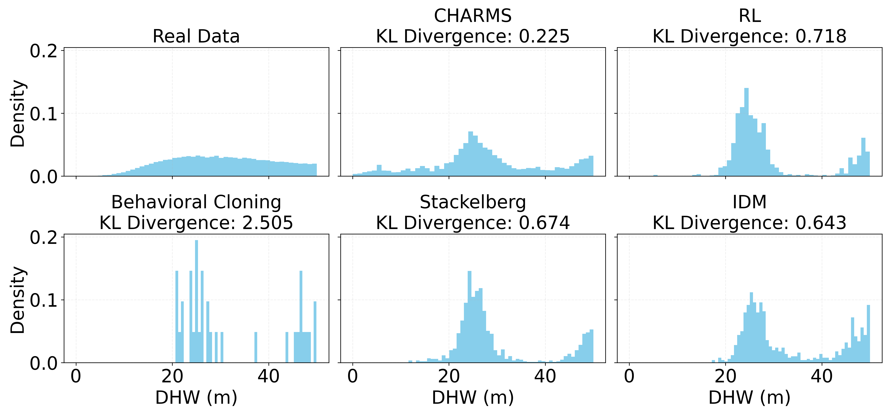

# CHARMS: A Cognitive Hierarchical Agent for Reasoning and Motion Stylization in Autonomous Driving

## 📄 Paper Information
**Jingyi Wang, Duanfeng Chu\*, Zejian Deng, Liping Lu and Pan Zhou**  
[arXiv:2504.02450](https://arxiv.org/abs/2504.02450#)

## 🧠 Introduction
<p align="center">
  
</p>
Leveraging Level-k game theory, we model human driver decision-making using reinforcement learning pretraining and supervised fine-tuning. This enables the resulting models to exhibit diverse behaviors, improving the intelligence and realism of surrounding vehicles in simulation. Building upon this capability, we further develop a scenario generation framework that utilizes the Poisson cognitive hierarchy theory to control the distribution of vehicles with different driving styles through Poisson and binomial sampling.

## 🚀 Getting Started

### Preparation
```bash
conda create -n charms python=3.8
conda activate charms
pip install -r requirements.txt
```

### Training and Testing
For RL Pretraining
```bash
cd train
python pretrain_with_rl.py
```
For SFT, please download the [**HighD**](https://www.highd-dataset.com/) dataset to `train/human_data/` and include only 3-lane highway recordings.
```bash
cd train
python finetune_with_bc.py
```
For testing, copy the .py file in exp to test/, and run with python

## 📊 Results

<p align="center">
  <br>
  <i>CHARMS-generated edge case</i>
</p>

### Decision-Making Performance Evaluation of Different EGO Models

| Ego Model         | Collision Rate | TTC<3s Frequency | Avg Speed | Acc Std | Yaw Std | Harsh Acc Rate |
|------------------|----------------|------------------|-----------|---------|---------|-----------------|
| IDM+MOBIL        | /              | /                | 23.67     | 1.425   | 0.009   | 0.033           |
| Stackelberg      | /              | /                | 23.73     | **1.092** | 0.007 | 0.036           |
| Imitaion Learning| 0.022          | 0.371            | 28.93     | 5.202   | 0.003   | 0.098           |
| Prior Level-k    | 0.023          | 0.487            | **32.19** | 5.399   | 0.007   | 0.024           |
| CHARMS           | **0.004**      | **0.068**        | 29.38     | 2.364   | **0.002** | **0.007**     |

<p align="center">
  <br>
  <i>Car FollowingSpeed Distribution Comparison</i>
</p>

<p align="center">
  <br>
  <i>Lane Change DHW Distribution Comparison</i>
</p>

## 📚 Citation

If you use this project, please cite our paper:
```bibtex
@misc{wang2025charmscognitivehierarchicalagent,
  title={CHARMS: Cognitive Hierarchical Agent with Reasoning and Motion Styles}, 
  author={Jingyi Wang and Duanfeng Chu and Zejian Deng and Liping Lu},
  year={2025},
  eprint={2504.02450},
  archivePrefix={arXiv},
  primaryClass={cs.RO},
  url={https://arxiv.org/abs/2504.02450},
}
```

Also cite the following dependencies:
```bibtex
@inproceedings{krajewski2018highd,
  title={The highd dataset: A drone dataset of naturalistic vehicle trajectories on german highways for validation of highly automated driving systems},
  author={Krajewski, Robert and Bock, Julian and Kloeker, Laurent and Eckstein, Lutz},
  booktitle={2018 21st international conference on intelligent transportation systems (ITSC)},
  pages={2118--2125},
  year={2018},
  organization={IEEE}
}
```

```bibtex
@misc{leurent2018highwayenv,
  author = {Edouard Leurent},
  title = {An Environment for Autonomous Driving Decision-Making},
  year = {2018},
  url = {https://github.com/eleurent/highway-env}
}
```

## 📄 License
This project is licensed under the MIT License - see the [LICENSE](LICENSE) file for details.
